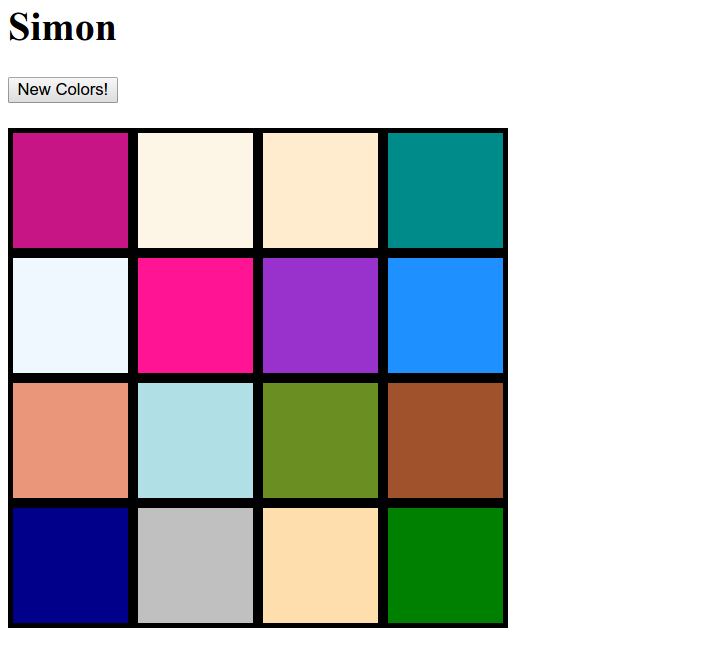
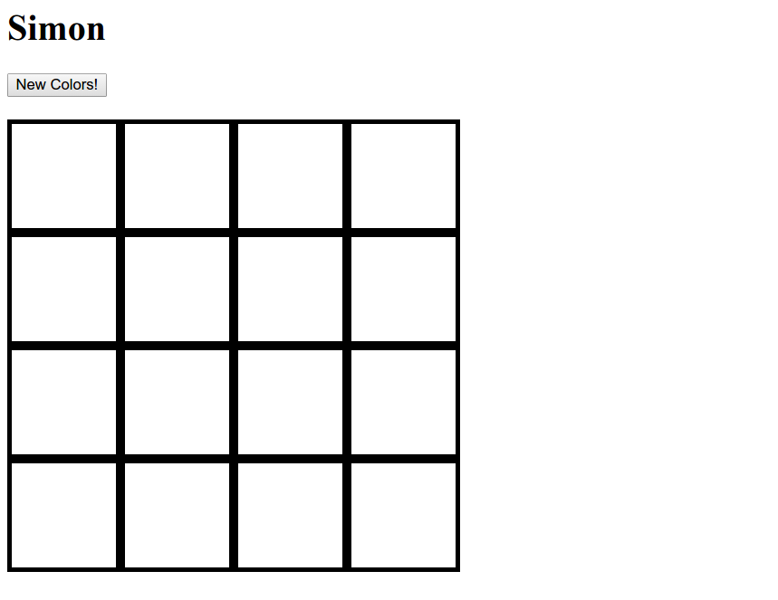
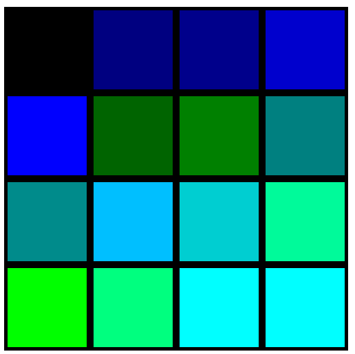

# unit-6SB-simon

## Introduction
We'll get started with Facebook's open-source front-end JavaScript framework, ReactJS. This week we'll see how React makes the DOM rich and dynamic.

## Summary
HTML is static. It doesn't move around or have programming logic. If we want our web apps to have these features, we can use JavaScript. JavaScript can programmatically generate HTML elements. For example:

```javascript
const p = document.createElement('p');
p.innerText = 'sup';
document.body.appendChild(p);
```

generates the following element:

```html
<body>
  <!-- DOM stuff-->
  <p>sup</p>
</body>
```

Using plain JavaScript can get labor-intensive and intractable for large applications. ReactJS decreases the complications of maintaining large websites using principles like object-orientated programming and modular code.A React application is made up of "components". You can think of a React component as a collection of HTML tags, except their behavior and appearance isn't static. Using React, we can reproduce the example from above:

```javascript
const p = <p>sup</p>;
const root = createRoot(document.body);
root.render(p);
```

Look at the first line in the example above. See that paragraph tag? That might come as a surprise because this code comes from a JavaScript file. This is called JSX syntax. JSX appears very similar to HTML, but there are a few key differences. We'll cover these differences in greater depth later. For now, we just need to know that JSX allows us to write HTML-like code in our javascript files.

A fundamental concept in React is the idea of "state". The state of a React app is essentially a javascript object that determines how React components will appear in the browser. So the same React components may look and behave differently depending on the state of the application. Any changes to the state will trigger an update, or "re-render", of components that depends on it. The state is convenient because it is one centralized variable from which all changes to the DOM will trickle down. For this challenge, we will use state to render different colors on a board and change them when a button is clicked.

## Learning Goals
* Generate the DOM structure using JavaScript
* Learn about React components and state
* Run a function when a button is clicked
* Change the DOM by updating the state

## Useful Links
* [React Docs](https://facebook.github.io/react/docs/react-component.html)
* [Build With React](http://buildwithreact.com/tutorial)

## How do I get started?
First, run `npm install` inside the project directory.
Your code will go in `main.jsx`. To see the results, run `npm start` and visit `http://localhost:8080` in your browser.

## Challenges
Have a look at `main.jsx`. Notice how an `<h2>` tag is created using jsx syntax. We pass it a React property, or prop, called "id", which we set to "colorHeader". It is placed in the DOM with `ReactDOM.render`. We can create a new type of React component by defining a JavaScript function. Notice the `Board` component we're creating. The return value of this function is what our component will look like when it's rendered. Let's use this to create a 4x4 board. 
- [ ] In the `Board` function, create 16 new React elements and add them to the `boxes` array. These elements should be `<div>` tags with the class `box` and have no children. 
- [ ] Then render the `boxes` array by adding them as children to the `div#board`. Don't worry about the CSS styling for the grid, it is already written in the `box` class. It should look like this:

Now let's give those boxes some color. 
- [ ] In addition to the `box` class, give each `div.box` another prop: `style`. This will be an `object` with key value pairs that are CSS properties and values. Use it to make each box have a red background. 
- [ ] We want these to be different colors, so let's take a different approach now. Within the Board component, we can use a special function, `useState`. This function runs when we render our Board component, and allows us to define and update its initial "state". Initialize the state variable `boxColors` as an object with keys 0-15, and assign their values to the first 16 strings in the `colors` array, which is an array of CSS colors. This array has already been defined in the `colors.js` file. It is global so you can access it in here. Then, when you create your boxes, instead of "red", give them a color from this `state`. The first box should be the color at index 0, the second should be the color at index 1, the third at index 2, etc.

Now let's make this appear different every time the page is loaded. 
- [ ] Go back to the `useState` call. Instead of the first 16 colors in the array, assign the keys to **random** elements from the `colors` array. Every time you refresh the page, the colors should all be different. 
- [ ] Finally, let's enable the "New Colors!" button. Within the board component, create a handler function called `update`. (This function is not recognized by React in any special way.) Now, on the button component, add another prop called `onClick`, and give it your new `update` function. `onClick` is a special prop that React recognizes. It runs the given function when that component is clicked. 
- [ ] Verify that your `update` handler gets called when the button is clicked. 
- [ ] Finally, within `update`, use `setBoxColors`, the setter returned from `useState`, to change the colors in the state to new random colors. When done right, the `Board` function is automatically called again and your board will change! Click the button a few times and make sure it works.

## How do I test my work?
There are no tests for this challenge. If it functions as expected, by changing to random colors when the button is clicked, you have completed this skill builder.
