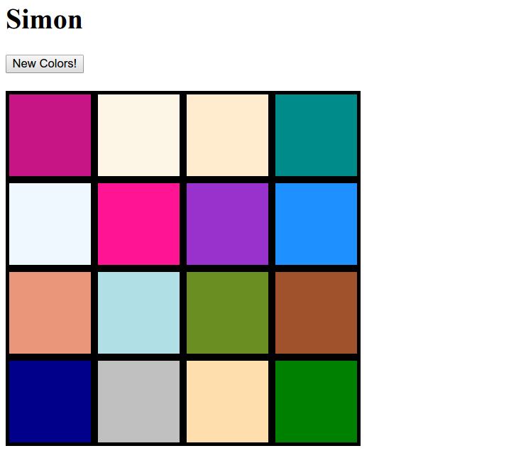
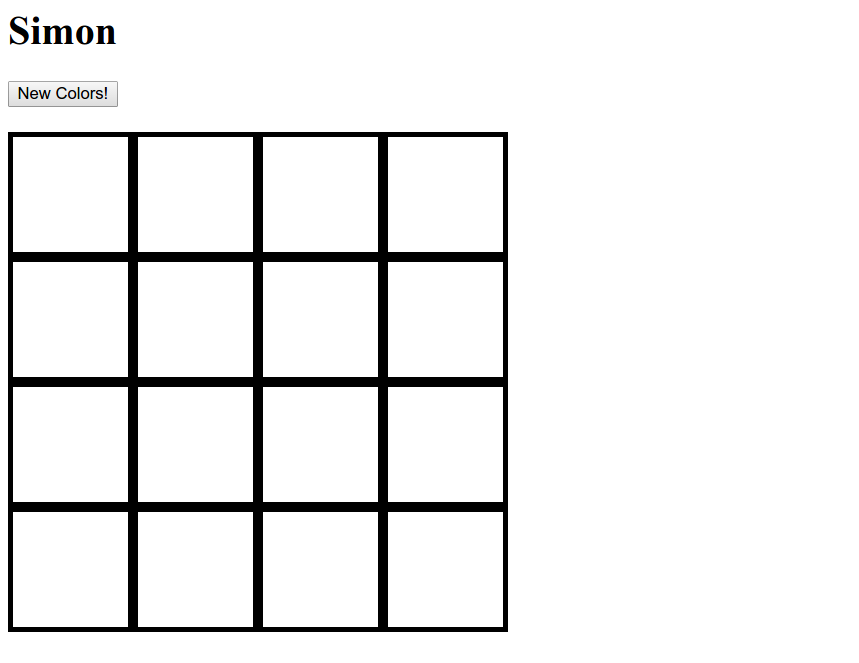
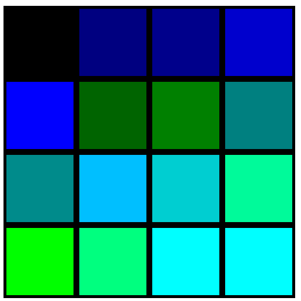

# unit-6SB-simon


##Introduction
We'll get started with Facebook's open-source front-end JavaScript framework, ReactJS. This week we'll see how React makes the DOM rich and dynamic.

##Summary
HTML is static. It doesn't move around or have programming logic. If we want our web apps to have these features, we can use JavaScript. JavaScript can programmatically generate HTML elements. For example:
```javascript
var p = document.createElement('p');
p.innerText = 'sup';
document.body.appendChild(p);
```
generates the following element:
```html
<body>
  <!-- DOM stuff -->
  <p>sup</p>
</body>
```

Using plain JavaScript can get labor-intensive and intractable for large applications. ReactJS decreases the complications of maintaining large websites using principles like object-orientation and modularity. Fortunately, the React API looks very similar to familiar JavaScript. React achieves the same net result with the following code:
```javascript
var p = React.createElement('p', null, 'sup');
ReactDOM.render(p, document.body);
```

React introduces the idea of "state". The state is a variable that allows the same tags to look different if they have different states. In React, the state is always an `object`. Your tags, or "components", can depend on this variable. Any changes to the state will trigger an update, or "re-render", of the component that depends on it. The state is convenient because it is one centralized variable from which all changes to the DOM will trickle down. For this challenge, we will use state to render different colors on a board and change them when a button is clicked.



##Learning Goals
- Generate the DOM structure using JavaScript
- Learn React methods
- Run a function when a button is clicked
- Change the DOM by updating the state

##Useful Links
[React for people who know just enough jQuery to get by](http://reactfordesigners.com/labs/reactjs-introduction-for-people-who-know-just-enough-jquery-to-get-by/)

[React Docs](https://facebook.github.io/react/docs/component-api.html)

##How do I get started?
Your code will go in `main.js`. Open the `index.html` to see the results.

##Challenges
Have a look at `main.js`. Notice how an `<h1>` tag is created with the `React.createElement` method. The first argument is the type of tag. The second is an object of HTML attributes and values (also known as "props" in React). The remaining arguments are the children of this element. It is placed in the DOM with `ReactDOM.render`.

`React.createClass` lets us **define our own tags**, a.k.a. components. Notice the `Board` class we're creating. This method takes an object. `render` is a special property on this object: a method that returns what our component will look like when it's rendered. Let's use this to create a 4x4 board. 

In the `render` function, create 16 new React elements and add them to the `boxes` array. These elements should be `<div>` tags with the class `box` and have no children. Then render the `boxes` array by adding them as children to the `div#board`. Don't worry about the CSS styling to handle the grid, it is already written in the `box` class. It should look like this:


Now let's give those boxes some color. In addition to the `box` class, give each `div.box` another prop: `style`. This will be an `object` with key value pairs that are CSS properties and values. Use it to make each box have a red background.

We want these to be different colors, so let's take a different approach now. Within the object provided to `createClass` lies another special method, `getInitialState`. This method returns an object that will be the "state". In this method, create an object that has the keys 0-15 and assign their values to the first 16 strings in the `colors` array, which is an array of CSS colors. This variable `colors` has already been defined in the `colors.js` file. It is global so you can access it in here. Be sure to return this object. Then, when you create your boxes, instead of "red", give them a color from this `state`. The first box should be the color at index 0, the second should be the color at index 1, the third at index 2, etc.


Let's make this appear different every time the page is loaded. Go back to the `getInitialState` method. Instead of the first 16 colors in the array, assign the keys to **random** elements from the `colors` array. Every time you refresh the page, the colors should all be different.

Finally, let's enable the "New Colors!" button. Within the object provided to `createClass`, create a custom method called `update`. This is not recognized by React in any special way. Now, on the button component, add another prop called `onClick`, and give it your new `update` function. `onClick` is a special prop that React recognizes. It runs the given function when that component is clicked. Verify that your `update` method gets called when the button is clicked. Finally, within `update`, use `this.setState`, a built-in React method, to change the colors in the state to new random colors. When done right, the `render` function is automatically called again and your board will change! Click the button a few times and make sure it works.

##How do I test my work?

There are no tests for this challenge. If it functions as expected, by changing to random colors when the button is clicked, you have completed this skill builder.
